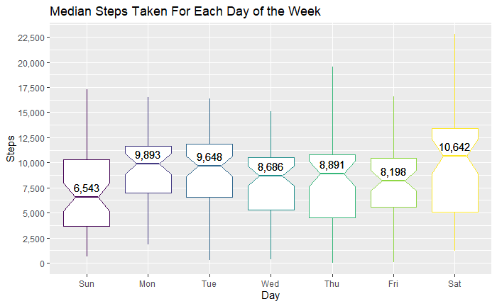
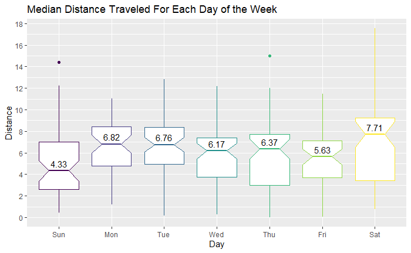
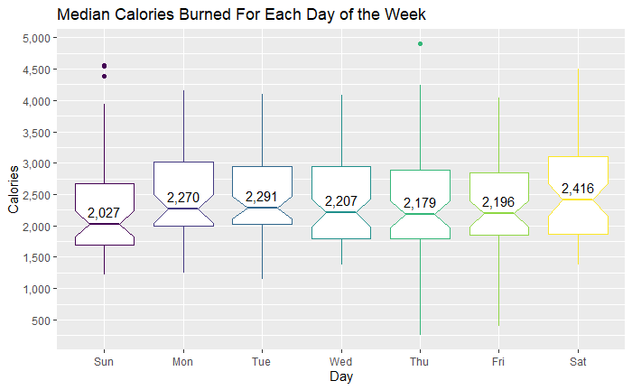
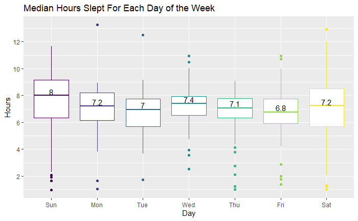
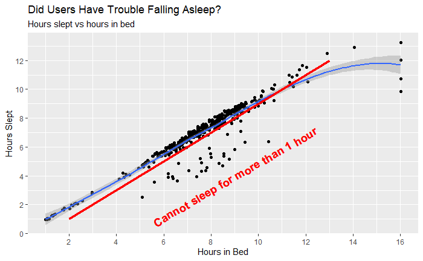
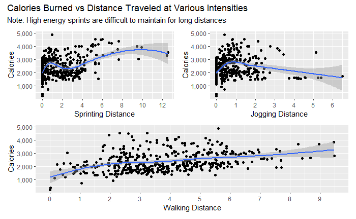
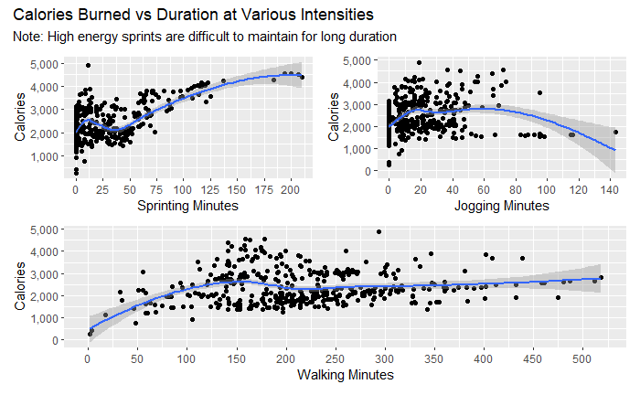

# Google Data Analytics Capstone Project
# Case Study 2: How Can a Wellness Technology Company Play It Smart?

## 1. Introduction

As part of the Google Data Analytics Program, I am tasked with completing a Capstone case study. The following information is part of the "Share" section of the project in which I present my findings to the stakeholders. I will be presenting each section's deliverable (ie. the conclusions of each section).

The complete project, with code and analysis, can be found in the "capstone_project.Rmd" file.

I have chosen to do this project in R because the dataset file size is too large to comfortably work in spreadsheets (Excel/Google Sheets). This project can be done in SQL, but R has many handy packages such as tidyverse for data cleaning and analysis.

## 2. Overview of Bellabeat and Objectives

Hello, I'm Brandon Luong, and I am part of the marketing analytics team at Bellabeat, a high-tech manufacturer of health-focused products for women. Bellabeat is a small successful company but has the potential for growth in the global smart device market. Urška Sršen believes that analyzing smart fitness data could help with this growth and unlock new opportunities for the company.

Bellabeat Mission Statement: Empower women with knowledge about their own health and habits by collecting data on activity, sleep, stress, and reproductive health.

The Bellabeat Products:

- Bellabeat app: The Bellabeat app provides users with health data related to their activity, sleep, stress, menstrual cycle, and mindfulness habits. This data can help users better understand their current habits and make healthy decisions. The Bellabeat app connects to their line of smart wellness products.
- Leaf: Bellabeat’s classic wellness tracker can be worn as a bracelet, necklace, or clip. The Leaf tracker connects to the Bellabeat app to track activity, sleep, and stress.
- Time: This wellness watch combines the timeless look of a classic timepiece with smart technology to track user activity, sleep, and stress. The Time watch connects to the Bellabeat app to provide you with insights into your daily wellness.
- Spring: This is a water bottle that tracks daily water intake using smart technology to ensure that you are appropriately hydrated throughout the day. The Spring bottle connects to the Bellabeat app to track your hydration levels.

Primary stakeholders:

- Urška Sršen: Cofounder and Chief Creative Officer
- Sando Mur: Cofounder and key member of the Bellabeat executive team

Secondary stakeholders:

- Bellabeat marketing analytics team: A team of data analysts responsible for collecting, analyzing, and reporting data that helps guide Bellabeat’s marketing strategy.

There are 3 main questions I want to answer in this analysis:

1. What are some trends in smart device usage?
2. How could these trends apply to Bellabeat customers?
3. How could these trends help influence Bellabeat marketing strategy?

**Business Task: Analyze smart device usage data for trends and insights and apply the new-found knowledge to one Bellabeat product, presenting high-level recommendations for how these trends can improve Bellabeat's marketing strategy.**

## 3. Data Inspection

The dataset can be found on Kaggle: [Fitbit Fitness Tracker Data](https://www.kaggle.com/arashnic/fitbit "Fitbit Fitness Tracker Data"), by Mobius under the CC0: Public Domain license.

It contains 18 csv files, 3 in wide format, rest in long:

- Data kept for analysis:

  - 'dailyActivity_merged.csv' as `daily_act`
  - 'sleepDay_merged.csv' as `daily_sleep`
  
- Data dropped from analysis:
  - 'dailyCalories_merged.csv'
  - 'dailyIntensities_merged.csv'
  - 'dailySteps_merged.csv'
  - 'hourlyCalories_merged.csv'
  - 'hourlyIntensities_merged.csv'
  - 'hourlySteps_merged.csv'
  - 'minuteCaloriesNarrow_merged.csv'
  - 'minuteCaloriesWide_merged.csv'
  - 'minuteIntensitiesNarrow_merged.csv'
  - 'minuteIntensitiesWide_merged.csv'
  - 'minuteStepsNarrow_merged.csv'
  - 'minuteStepsWide_merged.csv'
  - 'minuteSleep_merged.csv'
  - 'minuteMETsNarrow_merged.csv'
  - 'heartrate_seconds_merged.csv'
  - 'weightLogInfo.csv'
  
**Credibility: Poor**

- Not reliable. Data is severely incomplete and missing information such that it is not representative of the population.
- Not original. Data source is from a third-party user (not from Fitbit, government, or academic source).
- Somewhat comprehensive. There is enough variety of data to gain some insights in order to give recommendations to Bellabeat but with low confidence.
- Not current. Data collected from April 12, 2016 - May 12, 2016 - 5 years old.
- Has citation. Data was gathered via an Amazon survey from 30 consented Fitbit users. Hosted on Kaggle with usability of 10.0, meeting all of Kaggle's uploading requirements.

## 4. Data Cleaning

- Used tidyverse (dplyr), janitor, lubridate, and skimr packages.
- Converted all column names from pascal case to camel case.
- Renamed 'activity_date' and 'sleep_day' columns in `daily_act` and `daily_sleep`, respectively, to 'date'.
- Converted 'date' columns in `daily_act` and `daily_sleep` from character (string) data type to date data type.

- `daily_act` has no missing (NA) values.
- `daily_sleep` has no missing (NA) values.

- Merged `daily_act` and `daily_sleep` into `merged_df` using an inner join.

## 5. Data Analysis

Drop columns:

- tracker_distance
  - Identical to total_distance, except for 3 rows (0.7% difference).
- logged_activities_distance
  - 95% of values equal 0.
  - Remaining values recorded by 2 users.
- sedentary_active_distance 
  - 98.5% of values equal 0. 
  - Sedentary (mostly sitting as opposed to walking or running) won't be covering much distance if at all.
- total_sleep_records
  - 88.8% are 1, 10% are 2, and 0.72% are 3. 
  - The majority of the observations are 1 sleep record (ie. did not wake up during the middle of the night).
  
Add columns:

- day_of_week
  - Convert date to the day of the week.
- sleep_hours
  - Convert total_minutes_asleep to hours slept.
- in_bed_hours
  - Convert total_time_in_bed to hours in bed.

**Main Question 1. What are some trends in smart device usage?**

Trends:

- Sunday is the least active day.
  - Lowest average steps and distance.
  - Highest average and median number of hours slept.
  - "Lazy Sunday": relax indoors.
- Saturday is the most active day.
  - Highest average steps and distance.
  - Lowest average and median number of hours slept.
  - Free time on Saturday to exercise, go out and have drinks, and socialize.
- Wednesday is the 2nd most hours slept day.
  - "Hump Day": mid-work week tiredness and slump.
- Users slept more consistently on the weekdays and less consistently on the weekends.
- Users did not have any trouble sleeping.
  - in_bed_hours about the same as sleep_hours.
- Walking burns more calories than jogging or sprinting when performed for a longer duration or farther distance.

## 6. Key Findings

- Sundays are the least active day.
- Saturdays are the most active day.

- Wednesday is the 2nd most hours slept day of the week. 
- It is also known as "Hump Day," a reference to a camel's hump in which Wednesday is typically the most stressful day and one has to climb this hill (hump) to get through the work week.

- Users sleep more consistently on the weekdays than on the weekends.
- Ideal to have consistent sleep schedule throughout the entire week.

- Most users fell asleep within 1 hour of being in bed. 
- A couple instances in which users could not sleep for more than 1 hour but are quite few.

- All 3 intensity levels initially burn calories at an increasing rate. 
- Jogging is shown to burn calories at a decreasing rate as the distance or duration increases. 
- Sprinting does burn calories at an increasing rate only if it is performed for a long enough distance or duration.
  - Very difficult to realistically maintain.
  - Sprinting should be kept at short distances and duration.
- Walking is the only intensity shown to burn calories at an increasing rate as the distance or duration increases.

**Main Question 2. How could these trends apply to Bellabeat customers?**

Most Bellabeat customers are:

- Women
- Conscious or interested about their health and habits
- Want to improve their health and lifestyle
- Familiar with smart devices

These trends:

- Show common habits.
- Explain a way to improve one's lifestyle.
- Were extrapolated from smart device data.

## 7. Recommendations

**6. Your top high-level content recommendations based on your analysis**

**Main Question 3. How could these trends help influence Bellabeat marketing strategy?**

- Guide the Bellabeat app with new features to add.
- Market as a one of a kind fitness app that not only tracks general health and habits data, but also provides ways to improve overall health and solidify better habits, supported up by real data.

Recommendations:

> Caveat: The Fitbit data has poor credibility so trends may not be accurate. However, they provide a general framework for the following  recommendations to be added as new features to the Bellabeat app. Then a subsequent data study can be performed using the data gathered by the Bellabeat app in order to tweak the features to align with Bellabeat customers.

1. Implement new features based on Fitbit data trends.
  - Activity:
    - Keep steps data as a useful metric, but do not emphasize it.
      - There is no strong correlation that putting in more steps burns more calories.
      - Depends on the intensity of those steps. 
    - Emphasize and track data for walking and sprinting, depending on the user's time constraint. 
      - If the user inputs a limited time (eg. at work), then recommend performing some short-timed sprints. 
      - If the user inputs a lot of free time (eg. at home on the weekend), then recommend taking a long walk.
  - Sleep:
    - There is no need to add any sleep aids.
  - Stress:
    - Throughout Wednesday, send words of affirmation notifications to users to help them de-stress and keep pushing forward.
  - Mindfulness habits:
    - Encourage users to exercise on Sundays with reminder notifications. 
    - Encourage users to keep exercising on Saturdays with a scorecard.
      - Give out rewards to users who stay consistent throughout consecutive weeks. 
    - Track sleep data and aggregate them as weekdays vs weekends.
      - Send reminder notifications that it is ideal to have a consistent sleep schedule throughout the entire week.
2. Market Bellabeat app as a one-of-a-kind fitness app that has all the new features that not only track data but also help you improve your overall health and habits.
3. Collect data provided by this new framework.
4. Conduct a subsequent data study on the more up-to-date data based on Bellabeat customers to give more accurate recommendations.

## 8. Closing Thoughts

Thank you so much for taking the time to read through this. Again, this is only the deliverables (ie. conclusions) of each section. "capstone_project.Rmd" file contains all the code and full analysis for this project.

The case study was much more difficult than the rest of the Google Data Analytics courses, but I'm so glad I stuck with it and finished it! Working through a case study project taught me so much more than just watching the lectures and taking the quizzes. I'm looking forward to my next project!